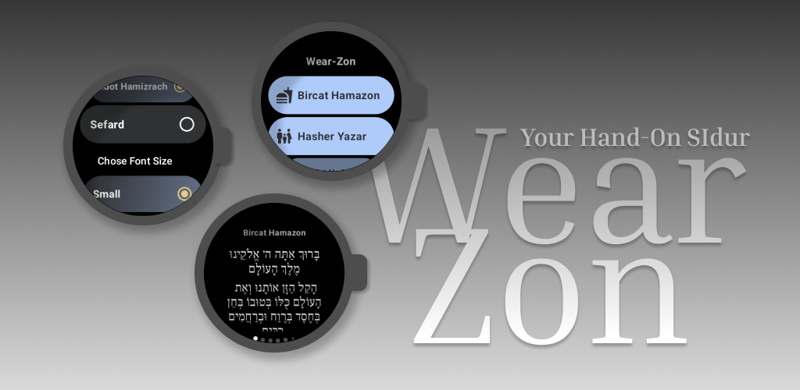
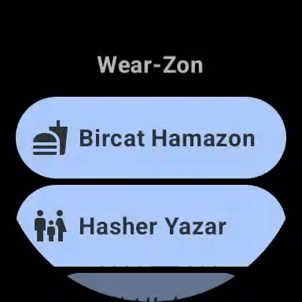

<h2>
ווירזון  - WearZon
</h2>
<h3>
ברכון בכף ידך!
</h3>

עם <b>ווירזון</b> יש לך גישה ישירות מהשעון החכם שלך לברכון חכם ונח שמתאים את עצמו אליך.

  ניתן להגדיר את האפליקציה להצגת בטקסטים בנוסח 
  <a href="#nusach">
  המועדף</a> עליכם, להציג את הטקסט עם ניקוד או בלי, וכן את גודל הטקסט.

 

<h5>תכנים זמינים:</h5>
<ul>
  <li>ברכת המזון</li>
  <li>תפילת הדרך</li>
  <li>ברכת ״אשר יצר״</li>
  <li>ברכת מעין שלוש - על המחיה</li>
  <li>ברכת ״בורא נפשות״</li>
  <li>קריאת שמע שעל המיטה</li>
</ul>

<h5 id="nusach">נוסחים זמינים:</h5>
<ul>
  <li>אשכנז</li>
  <li>ספרד</li>
  <li>עדות המזרח</li>
</ul>

